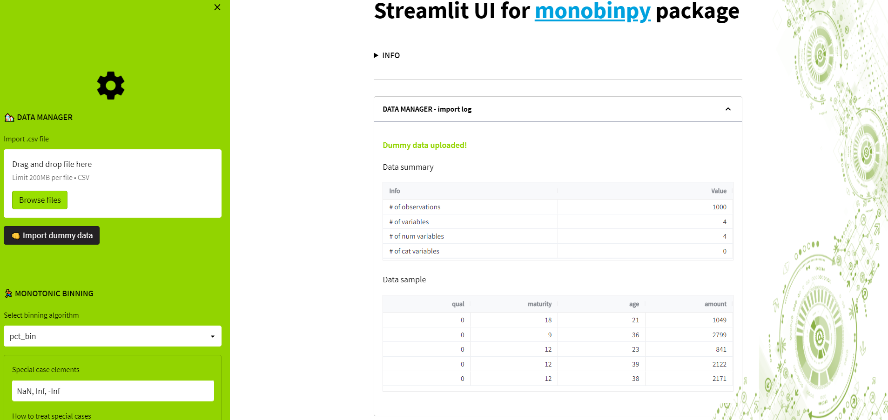

# monobinst

The purpose of this application is to create Streamlit UI for [monobinpy](https://pypi.org/project/monobinpy) package.
For time being application can be run only locally, and the main requirements are given below:
```cmd
streamlit
st_aggrid
monobinpy
pandas
pathlib
base64
os
inspect
PIL

``` 

Using ```git clone``` user can easily set up the application environment following the next 4 steps:

*   Step 1 - open cmd and set working directory:
```cmd
cd "your application directory" 

```
*   Step 2 - clone the repository using ```git clone```:
```cmd
git clone https://github.com/andrija-djurovic/monobinst

```
*   Step 3 - move working directory one folder up:
```cmd
cd ".\monobinst"

```
*   Step 4 - start app using ```streamlit```:
```cmd
streamlit run app.py

```

Another way to set up the application enviornment is to download repository zip file, then to unzipp it in selected folder
and finally to run ```streamlit``` from the same folder (like the 3rd step from above). 

Here are few print screens after successful start of the application.

*   Starting app window
<!-- -->

*   Import of dummy data
<!-- -->

*   Running one of the binning algorithms
<!-- -->


Happy Streamlit-ing :smile:
